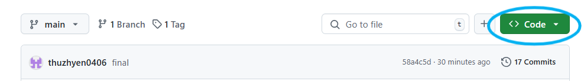
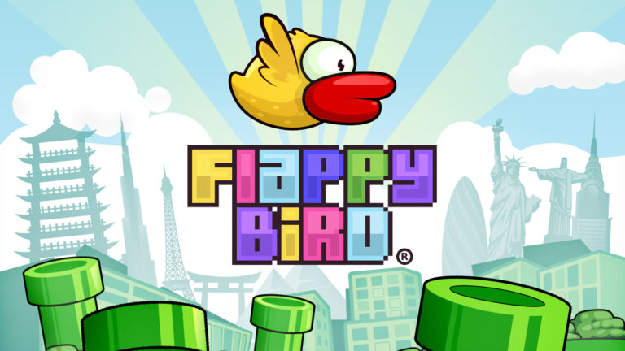
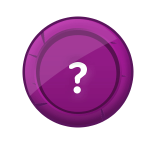
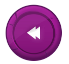
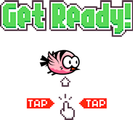
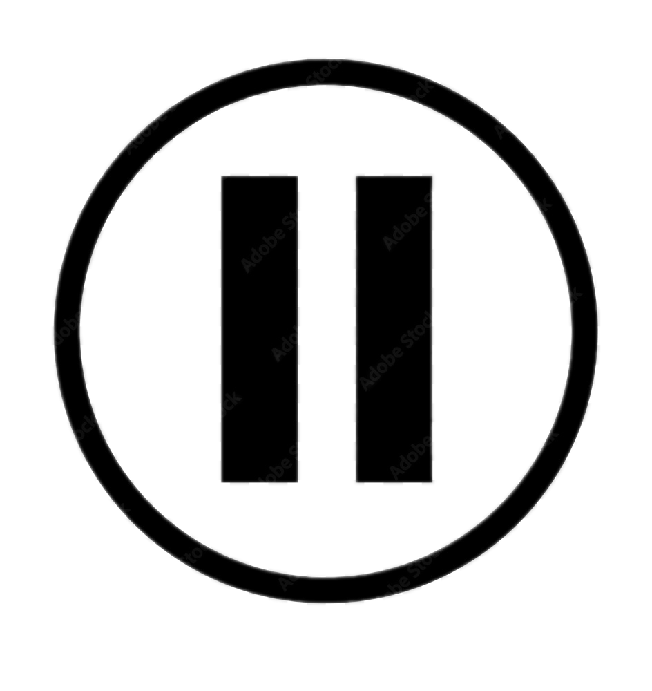
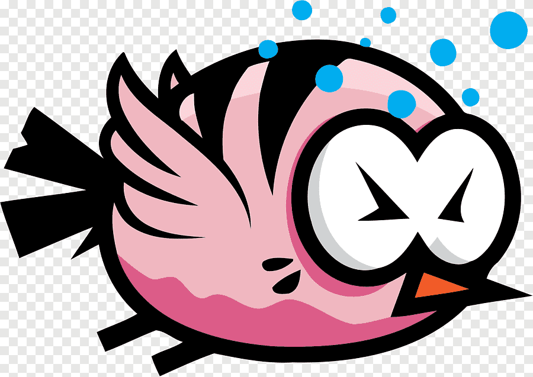
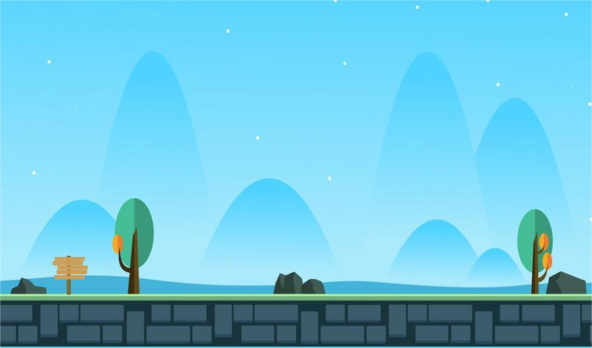
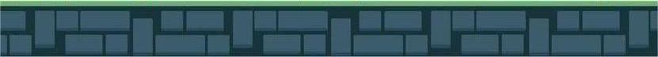
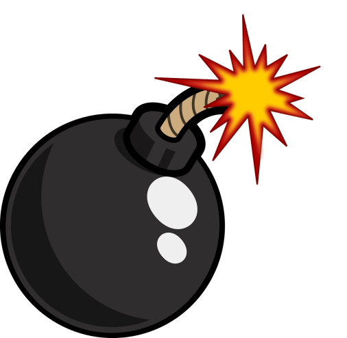

# Flappy-Bird
 
- Trải nghiệm game: [ Flappy_bird_demo](https://drive.google.com/drive/folders/1kQlzSFlxP5Gii3i2sOyYhcuLANO-w1Bh?usp=drive_link)

- [1. Giới thiệu game](#1-giới-thiệu-game)
- [2. Cách tải game](#2-cách-tải-game)
    * [a. Cách 1: Không bao gồm code.](#a-cách-1-không-bao-gồm-code)
    * [b. Cách 2: Bao gồm code và có thể biên dịch.](#b-cách-2-bao-gồm-code-và-có-thể-biên-dịch)
- [3. Bắt đầu game](#3-bắt-đầu-game)

- [4. Cách chơi](#4-cách-chơi)
   
- [5. Source code](#5-source-code)

## 1. Giới thiệu game
Flappy Bird là một trò chơi đơn giản nhưng cực kỳ gây nghiện. Người chơi điều khiển một chú chim bay qua các ống nước bằng cách chạm vào màn hình để giúp chim bay lên. Mục tiêu là vượt qua càng nhiều ống càng tốt mà không va vào chúng. Với lối chơi dễ hiểu nhưng khó chinh phục, Flappy Bird thử thách phản xạ và sự kiên nhẫn, khiến người chơi luôn muốn thử sức để phá vỡ kỷ lục của chính mình.

## 2. Cách tải game
### a. Cách 1: Không bao gồm code.

Tải game (được nén thành .zip) tại link
sau: https://github.com/thuzhyen0406/Flappy-Bird/releases/tag/v1 
Sau đó mở file Flappy bird.exe chơi  
Cách này giúp tiết kiệm bộ nhớ và thời gian tải.

### b. Cách 2: Bao gồm code và có thể biên dịch.

**Bước 1:** Clone repo này về.  
Hoặc Chọn Code -> Download Zip.

**Bước 2:** Cài mingw. Ở đây tôi cài đặt phiên bản MinGW-W64
GCC-8.1.0 [x86_64-posix-seh](https://sourceforge.net/projects/mingw-w64/files/Toolchains%20targetting%20Win64/Personal%20Builds/mingw-builds/8.1.0/threads-posix/seh/x86_64-8.1.0-release-posix-seh-rt_v6-rev0.7z/download). 
Một số chú ý:  

- Nếu sử dụng trình biên dịch khác thì phải dịch lại icon: vào thư mục icon rồi dùng
  lệnh `windres main.rc -O coff main.res` trong cmd. 
- Phải xóa ba dll của c++ trong thư mục chứa pvz.exe: `libgcc_s_seh-1.dll`, `libstdc++-6.dll`, `libwinpthread-1.dll`. Ba
  dll này chỉ dành cho người chơi không cài sẵn c++ trong máy.

**Bước 3:** Cài GNU make

**Bước 4:** Mở cmd và gõ lệnh make

**Bước 5:** Bật Flappy bird.exe và chơi

## 3. Bắt đầu game

  
[📌Nguồn](https://www.instagram.com/10xchallenge/p/C_3PzCdChff/?api=postMessagehttps%3A%2F%2Fwww.instagram.com%2Fp%2FC6ik27WJvMP%2F%3Fapi%3DpostMessage&hl=zh-cn)
- Để xem hướng dẫn chọn:  
  
- Để quay lại chọn:  
  

- Người chơi nhấn Enter hoặc chọn để chuyển sang màn hình chờ.  

 

 - Từ màn hình chờ, nhấn chuột trái hoặc Enter để chơi.  
 

 ## 4. Cách chơi

### Cách điều khiển
- **Nhấn phím SPACE / Enter** hoặc **click chuột** để điều khiển chú chim bay lên
- Thả phím/chuột để chú chim rơi xuống tự nhiên
- Nhấn phím **S** để tạm dừng game hoặc tiếp tục

 

- Nhấn phím **M** để tắt/bật âm thanh
- Nhấn phím **R** để chơi lại sau khi game kết thúc

### Mục tiêu của game
- Điều khiển chú chim bay qua các ống nước (cột chướng ngại vật)
- Cố gắng đạt điểm số cao nhất có thể

### Các yếu tố trong game
1. **Chú chim**:
   - Bay lên khi bạn nhấn phím/chuột
   - Rơi xuống do trọng lực khi bạn không nhấn gì

  
[📌Nguồn](https://www.pngegg.com/en/png-ygauv)
 
2. **Ống nước (ống xanh)**:
   - Xuất hiện ngẫu nhiên với khoảng cách khác nhau
   - Có khoảng trống ở giữa để chim bay qua  
[📌Nguồn](https://toppng.com/free-image/flappy-bird-pipe-png-steel-casing-pipe-PNG-free-PNG-Images_171862)
  

3. **Nền game**:

  
[📌Nguồn](https://fr.vecteezy.com/vecteur-libre/game-background)  
- Di chuyển liên tục tạo cảm giác chú chim đang bay

4. **Hộp quà**
- Xuất hiện ngẫu nhiên, ăn được cộng **5 điểm**

5. **Bom**
- Xuất hiện ngẫu nhiên. Khi ăn lần đầu thì yếu tố vật lí của game bị đảo ngược (nhấn phím thì bay xuống, nhả phím tự bay lên), ăn lần 2 các yếu tố trở lại bình thường.

 
6. **Điểm**
- Điểm kỉ lục được hiện ở góc trái, điểm hiện tại hiện giữa màn hình phía trên.
### Mẹo chơi game
- **Không nhấn liên tục**: Chỉ nhấn khi cần điều chỉnh độ cao
- **Giữ nhịp độ ổn định**: Tìm một nhịp nhấn phím phù hợp
- **Tập trung vào khe hở**: Nhắm vào khoảng trống giữa các ống

### Điều kiện thua cuộc
Bạn sẽ thua và game kết thúc khi:
- Chim chạm vào ống nước (trên hoặc dưới)
- Chim rơi xuống đất
- Chim bay quá cao ra khỏi màn hình

## 5. Source code
- main.cpp: chứa hàm main() của trò chơi
- background.h: các hàm load ảnh và vẽ lên randerer
- bgr_wait.h: hiển thị màn hình chờ chơi, kết thúc game
- overall.h: các hàm đợi nhấn phím
- pipe.h: sinh cột và cập nhật các cột
- bird.h: vẽ ảnh chim, kiểm tra chim bay qua cột hay va chạm, cập nhật vị trí của chim
- music.h: hàm chạy, dừng nhac
- score.h: cập nhật điểm hiện tại và kỉ lục
- text.h: các hàm vẽ chữ lên màn hình
